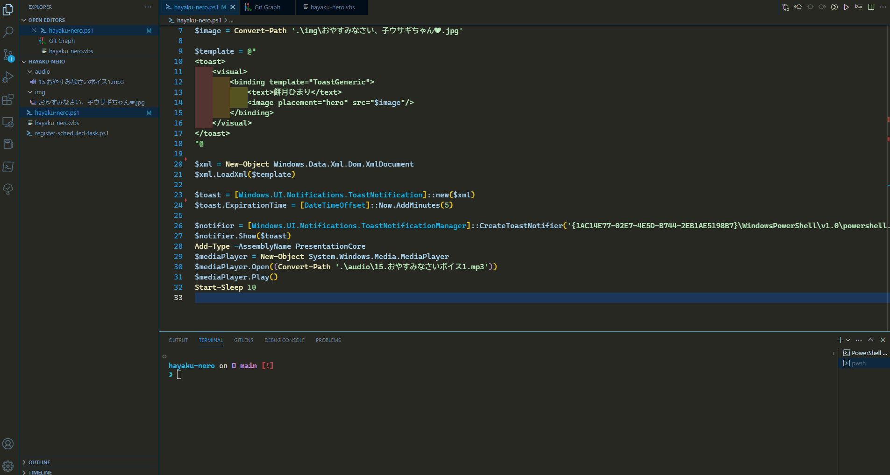
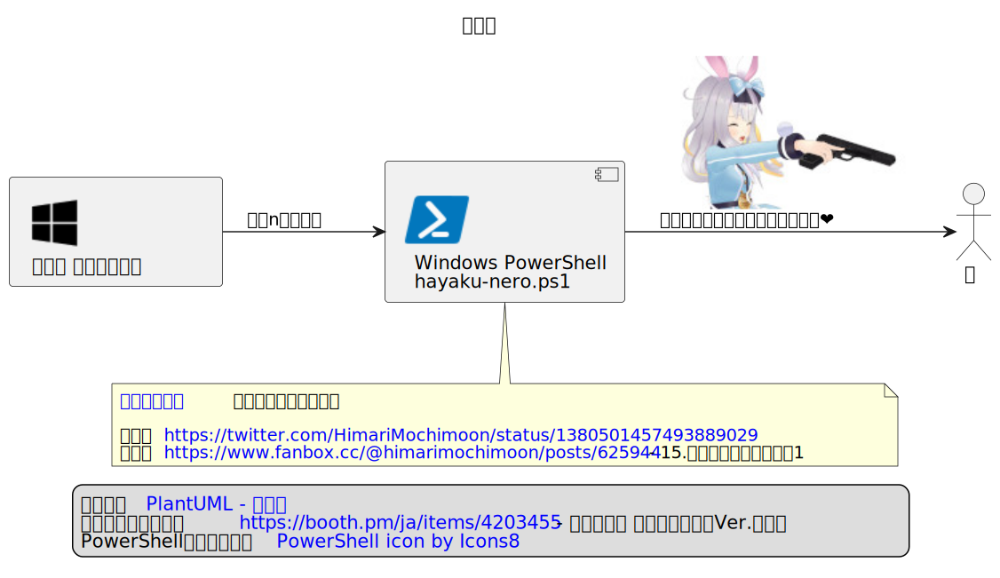

# 296-WS-DIY

以下の企画への投稿作品のドキュメント

<blockquote class="twitter-tweet">
【募集】 2月9日（木）の配信で、 みんなのお家にある、DIY作品を紹介したいと思います🔧 DIY作品の写真に、ポイントやエピソードなどを添えてツイートお願いします❗️工作作品は　<a href="https://twitter.com/hashtag/%E3%81%A4%E3%81%8F%E3%82%8B%E5%B7%A5%E4%BD%9C%E5%AE%A4?src=hash&amp;ref_src=twsrc%5Etfw">#つくる工作室</a>　でツイートお願いします💪 2月8日〆切です❗️ <a href="https://t.co/3pPSjaq8hE">pic.twitter.com/3pPSjaq8hE</a>
&mdash; 図月つくる🔧 (@ZutsukiTsukuru) <a href="https://twitter.com/ZutsukiTsukuru/status/1619968094289670146?ref_src=twsrc%5Etfw">January 30, 2023</a></blockquote> 

## hayaku-nero

餅月ひまりちゃんに寝るように言ってもらうスクリプト

> **Note**  
> 画像内のリンクは https://raw.githubusercontent.com/ekishouTV/296-WS-DIY/main/%E4%BB%95%E7%B5%84%E3%81%BF.svg からだとアクセスできる

### 何でつくろうと思ったの？

以下のひまりちゃんのツイートを見て、「この画像を寝る準備を始める時間に表示できれば、早寝できるのでは？」となったこと。

<blockquote class="twitter-tweet">
本日配信出来なかったお詫びの、無邪気に銃口を向けるひまりです。何かにお使いください🥺 <a href="https://t.co/K8paXtBxcv">pic.twitter.com/K8paXtBxcv</a>
&mdash; 餅月ひまり🌕 (@HimariMochimoon) <a href="https://twitter.com/HimariMochimoon/status/1380501457493889029?ref_src=twsrc%5Etfw">April 9, 2021</a></blockquote>  

### 効果あるの？

画像が表示されてから、30分後ぐらいから準備し始めている。 
